# Gift Reveal PoC - Komplett Implementeringsguide

**Prosjekt:** Digital Gavekort Opplevelse - Frontend Prototype
**Versjon:** 1.0
**Dato:** November 2024
**Teknologi:** Vite + TypeScript + Vanilla JS

---

## 📋 Innholdsfortegnelse
1. [Kontekst & Bakgrunn](#kontekst--bakgrunn)
2. [Scope & Avgrensninger](#scope--avgrensninger)
3. [Teknisk Arkitektur](#teknisk-arkitektur)
4. [Setup & Installasjon](#setup--installasjon)
5. [Prosjektstruktur](#prosjektstruktur)
6. [Implementeringsguide](#implementeringsguide)
7. [Mock Data & Scenarios](#mock-data--scenarios)
8. [Testing & Deploy](#testing--deploy)
9. [Migrering til Produksjon](#migrering-til-produksjon)

---

## 1. Kontekst & Bakgrunn

### Forretningsbehov
iGive ønsker å transformere gavekortopplevelsen fra statiske PDF-er til en interaktiv digital opplevelse. Mottakere skal få en minneverdig "unwrapping"-opplevelse med animasjoner før gavekortet overføres til Mine Gavekort-appen.

### Brukerreise

```mermaid
graph LR
    A[Mottaker får SMS/e-post] --> B[Klikker deeplink]
    B --> C[Ser animert gaveboks]
    C --> D[3-tap unwrapping]
    D --> E[Konfetti & gavekort vises]
    E --> F[Hent til app-knapp]
    F --> G[Deeplink til Mine Gavekort]
```


### Teknisk flyt
1. **Web-side** viser kun animasjon og metadata (IKKE kort-koder)
2. **"Hent gavekortet"** sender bruker til Mine Gavekort-appen
3. **Appen** håndterer all aktivering og kort-koder

---

## 2. Scope & Avgrensninger

### ✅ I Scope for PoC
- Routing for `/g/{code}` deeplinks
- Lottie-animasjoner (3 temaer: bursdag, bryllup, generisk)
- 3-stegs progressiv unwrapping
- Konfetti-celebrasjon
- Mock data for ulike scenarios
- Responsive design (mobil-først)
- "Hent gavekortet" knapp med deeplink
- Error states og loading states

### ❌ Utenfor Scope
- Faktiske API-kall (kun mock)
- Autentisering
- Aktivering av kort (skjer i app)
- Visning av kort-koder
- Analytics (kun console.log)
- Multi-språk
- Custom animasjoner
- Video/audio

### 🎯 Success Kriterier
- Animasjon laster < 2 sekunder
- 60fps animasjoner på iPhone X
- Fungerer på iOS Safari 14+, Chrome 90+
- Deeplink til app fungerer

---

## 3. Teknisk Arkitektur

### Stack
- **Build Tool:** Vite 5.x
- **Language:** TypeScript 5.x
- **Animasjoner:** Lottie Web 5.x
- **Konfetti:** Canvas Confetti
- **Styling:** SCSS + CSS Modules
- **Deploy:** Vercel/Netlify

### Design Patterns
```typescript
// Service Layer Pattern - for enkel migrering
interface IGiftService {
  getGift(code: string): Promise<Gift>
  markAsOpened(code: string): Promise<void>
  getDeepLink(code: string): string
}

// Factory Pattern - for mock/real switching
const giftService = createGiftService(USE_MOCKS)

// Observer Pattern - for state management
class GiftRevealState extends EventTarget {
  private state: RevealState
  updateState(newState: Partial<RevealState>) {
    this.dispatchEvent(new CustomEvent('statechange'))
  }
}
```

---

## 4. Setup & Installasjon

### Prerequisitter
- Node.js 18+ og npm 9+
- Git
- VS Code (anbefalt)

### Steg-for-steg Setup

```bash
# 1. Opprett nytt repo og prosjekt
git clone https://github.com/igive/gift-reveal-poc.git
cd gift-reveal-poc

# 2. Initialiser Vite-prosjekt
npm create vite@latest . -- --template vanilla-ts

# 3. Installer dependencies
npm install lottie-web canvas-confetti
npm install -D sass @types/node @types/canvas-confetti

# 4. Slett default Vite-filer
rm -rf src/counter.ts src/style.css
```

### package.json
```json
{
  "name": "gift-reveal-poc",
  "version": "0.1.0",
  "type": "module",
  "scripts": {
    "dev": "vite",
    "build": "tsc && vite build",
    "preview": "vite preview",
    "test": "vitest",
    "deploy": "vercel"
  },
  "dependencies": {
    "lottie-web": "^5.12.2",
    "canvas-confetti": "^1.9.3"
  },
  "devDependencies": {
    "@types/canvas-confetti": "^1.6.4",
    "@types/node": "^20.10.0",
    "sass": "^1.69.5",
    "typescript": "^5.3.0",
    "vite": "^5.0.0",
    "vitest": "^1.0.0"
  }
}
```

### TypeScript Config (tsconfig.json)
```json
{
  "compilerOptions": {
    "target": "ES2022",
    "useDefineForClassFields": true,
    "module": "ESNext",
    "lib": ["ES2022", "DOM", "DOM.Iterable"],
    "skipLibCheck": true,
    "moduleResolution": "bundler",
    "allowImportingTsExtensions": true,
    "resolveJsonModule": true,
    "isolatedModules": true,
    "noEmit": true,
    "jsx": "preserve",
    "strict": true,
    "noUnusedLocals": true,
    "noUnusedParameters": true,
    "noFallthroughCasesInSwitch": true,
    "paths": {
      "@/*": ["./src/*"]
    }
  },
  "include": ["src"]
}
```

---

## 5. Prosjektstruktur

```
gift-reveal-poc/
├── public/
│   ├── animations/
│   │   ├── birthday.json      # Lottie animasjon
│   │   ├── wedding.json       # Lottie animasjon
│   │   └── generic.json       # Lottie animasjon
│   └── images/
│       └── vendors/           # Vendor logoer
│
├── src/
│   ├── core/                  # Forretningslogikk
│   │   ├── models/
│   │   │   └── gift.model.ts
│   │   ├── services/
│   │   │   ├── gift.service.ts
│   │   │   ├── mock.service.ts
│   │   │   └── deeplink.service.ts
│   │   └── utils/
│   │       ├── validators.ts
│   │       └── formatters.ts
│   │
│   ├── ui/                    # Presentasjon
│   │   ├── components/
│   │   │   ├── GiftBox.ts
│   │   │   ├── Confetti.ts
│   │   │   └── MessageCard.ts
│   │   ├── animations/
│   │   │   └── reveal.animation.ts
│   │   └── styles/
│   │       ├── main.scss
│   │       ├── animations.scss
│   │       └── responsive.scss
│   │
│   ├── mocks/
│   │   ├── scenarios.json
│   │   └── mock-factory.ts
│   │
│   ├── config/
│   │   └── app.config.ts
│   │
│   ├── main.ts               # Entry point
│   └── router.ts             # URL routing
│
├── index.html
├── vite.config.ts
└── README.md
```

---

## 6. Implementeringsguide

### 6.1 Entry Point (index.html)
```html
<!DOCTYPE html>
<html lang="no">
<head>
  <meta charset="UTF-8">
  <meta name="viewport" content="width=device-width, initial-scale=1.0, maximum-scale=1.0, user-scalable=no">
  <meta name="apple-mobile-web-app-capable" content="yes">
  <title>Du har fått et gavekort! 🎁</title>
  <link rel="preconnect" href="https://fonts.googleapis.com">
  <link href="https://fonts.googleapis.com/css2?family=Inter:wght@400;600;700&display=swap" rel="stylesheet">
</head>
<body>
  <div id="app">
    <!-- Initial loading state -->
    <div class="loader">
      <div class="loader-spinner"></div>
      <p>Henter gaven din...</p>
    </div>
  </div>
  <script type="module" src="/src/main.ts"></script>
</body>
</html>
```

### 6.2 Main Application (src/main.ts)
```typescript
import './ui/styles/main.scss';
import { Router } from './router';
import { GiftRevealController } from './controllers/GiftRevealController';
import { createGiftService } from './core/services/gift.service';
import { config } from './config/app.config';

class App {
  private router: Router;
  private container: HTMLElement;

  constructor() {
    this.container = document.getElementById('app')!;
    this.router = new Router();
    this.initializeRoutes();
  }

  private initializeRoutes(): void {
    // Gift reveal route: /g/{code}
    this.router.register(/^\/g\/([a-zA-Z0-9]{8})$/, async (match: RegExpMatchArray) => {
      const code = match[1];
      const controller = new GiftRevealController(
        this.container,
        createGiftService(config.USE_MOCKS)
      );
      await controller.initialize(code);
    });

    // Default route
    this.router.register(/^.*$/, () => {
      this.showError('Ugyldig gave-link');
    });
  }

  private showError(message: string): void {
    this.container.innerHTML = `
      <div class="error-state">
        <h1>😕 Oops!</h1>
        <p>${message}</p>
      </div>
    `;
  }

  public start(): void {
    // Parse URL and navigate
    const path = window.location.pathname;
    this.router.navigate(path);
  }
}

// Start application
const app = new App();
app.start();
```

### 6.3 Gift Model (src/core/models/gift.model.ts)
```typescript
export interface Gift {
  id: string;
  code: string;
  vendorName: string;
  vendorLogoUrl: string;
  amount: number;
  currency: 'NOK';
  personalMessage?: string;
  senderName: string;
  animationType: 'birthday' | 'wedding' | 'generic';
  expiryDate?: Date;
  isOpened: boolean;
  isActivated: boolean;
}

export interface RevealState {
  step: 'loading' | 'ready' | 'shaking' | 'unwrapping' | 'revealed' | 'transferred';
  tapsRemaining: number;
  animationProgress: number;
  error?: string;
}

export interface TransferResponse {
  success: boolean;
  appDeepLink: string;
  fallbackUrl: string;
}
```

### 6.4 Gift Service (src/core/services/gift.service.ts)
```typescript
import { Gift, TransferResponse } from '../models/gift.model';
import { MockGiftService } from './mock.service';
import { ApiGiftService } from './api.service';

export interface IGiftService {
  getGift(code: string): Promise<Gift>;
  markAsOpened(code: string): Promise<void>;
  getTransferLink(code: string): TransferResponse;
}

export function createGiftService(useMocks: boolean): IGiftService {
  return useMocks ? new MockGiftService() : new ApiGiftService();
}
```

### 6.5 Mock Service (src/core/services/mock.service.ts)
```typescript
import { IGiftService } from './gift.service';
import { Gift, TransferResponse } from '../models/gift.model';
import mockScenarios from '../../mocks/scenarios.json';

export class MockGiftService implements IGiftService {
  private delay(ms: number): Promise<void> {
    return new Promise(resolve => setTimeout(resolve, ms));
  }

  async getGift(code: string): Promise<Gift> {
    await this.delay(800); // Simulate network delay

    const scenario = mockScenarios[code] || mockScenarios['default'];

    if (scenario.error) {
      throw new Error(scenario.error);
    }

    return {
      ...scenario,
      code,
      expiryDate: scenario.expiryDate ? new Date(scenario.expiryDate) : undefined
    };
  }

  async markAsOpened(code: string): Promise<void> {
    await this.delay(300);
    console.log(`[Mock] Gift ${code} marked as opened`);
  }

  getTransferLink(code: string): TransferResponse {
    return {
      success: true,
      appDeepLink: `igive://add-gift?code=${code}&token=${this.generateMockToken()}`,
      fallbackUrl: 'https://apps.apple.com/no/app/mine-gavekort/id123456'
    };
  }

  private generateMockToken(): string {
    return btoa(JSON.stringify({
      code: Math.random().toString(36).substr(2, 9),
      exp: Date.now() + 300000
    }));
  }
}
```

### 6.6 Gift Reveal Controller (src/controllers/GiftRevealController.ts)
```typescript
import { Gift, RevealState } from '../core/models/gift.model';
import { IGiftService } from '../core/services/gift.service';
import { GiftBoxAnimation } from '../ui/animations/GiftBoxAnimation';
import { ConfettiEffect } from '../ui/components/Confetti';

export class GiftRevealController {
  private state: RevealState = {
    step: 'loading',
    tapsRemaining: 3,
    animationProgress: 0
  };

  constructor(
    private container: HTMLElement,
    private giftService: IGiftService
  ) {}

  async initialize(code: string): Promise<void> {
    try {
      // 1. Load gift data
      const gift = await this.giftService.getGift(code);

      // 2. Check if already activated
      if (gift.isActivated) {
        this.showAlreadyActivated(gift);
        return;
      }

      // 3. Render gift box
      await this.renderGiftBox(gift);

      // 4. Mark as opened
      if (!gift.isOpened) {
        await this.giftService.markAsOpened(code);
      }

      // 5. Setup interactions
      this.setupInteractions(gift);

    } catch (error) {
      this.showError(error.message);
    }
  }

  private async renderGiftBox(gift: Gift): Promise<void> {
    this.container.innerHTML = `
      <div class="gift-reveal-container">
        <div class="gift-header">
          <p class="sender-text">Fra ${gift.senderName}</p>
        </div>

        <div class="gift-box-wrapper">
          <div id="animation-container"></div>
          <div class="tap-indicator ${this.state.step === 'ready' ? 'visible' : ''}">
            <span class="tap-count">${this.state.tapsRemaining}</span>
            <span class="tap-text">trykk for å åpne</span>
          </div>
        </div>

        <div class="gift-content hidden" id="gift-content">
          <div class="vendor-logo">
            
          </div>
          <h1 class="gift-amount">${gift.amount} kr</h1>
          ${gift.personalMessage ? `
            <div class="message-card">
              <p>${gift.personalMessage}</p>
              <span class="sender">- ${gift.senderName}</span>
            </div>
          ` : ''}
          <button class="cta-button" id="transfer-button">
            Hent gavekortet 🎁
          </button>
        </div>
      </div>
    `;

    // Load animation
    const animation = new GiftBoxAnimation();
    await animation.load(
      document.getElementById('animation-container')!,
      gift.animationType
    );

    this.state.step = 'ready';
  }

  private setupInteractions(gift: Gift): void {
    const container = document.querySelector('.gift-box-wrapper') as HTMLElement;

    container.addEventListener('click', async () => {
      if (this.state.tapsRemaining > 0) {
        await this.handleTap(gift);
      }
    });

    // Transfer button
    document.getElementById('transfer-button')?.addEventListener('click', () => {
      this.handleTransfer(gift);
    });
  }

  private async handleTap(gift: Gift): Promise<void> {
    this.state.tapsRemaining--;

    // Update UI
    const indicator = document.querySelector('.tap-indicator');
    if (indicator) {
      indicator.querySelector('.tap-count')!.textContent =
        this.state.tapsRemaining.toString();
    }

    // Play animation segment
    const animation = new GiftBoxAnimation();

    if (this.state.tapsRemaining === 2) {
      // Shake
      await animation.playShake();
    } else if (this.state.tapsRemaining === 1) {
      // Start unwrap
      await animation.playUnwrap();
    } else if (this.state.tapsRemaining === 0) {
      // Final reveal
      await animation.playReveal();
      await this.showGiftContent(gift);
    }
  }

  private async showGiftContent(gift: Gift): Promise<void> {
    // Hide tap indicator
    document.querySelector('.tap-indicator')?.classList.remove('visible');

    // Show content with animation
    const content = document.getElementById('gift-content');
    content?.classList.remove('hidden');
    content?.classList.add('fade-in');

    // Trigger confetti
    const confetti = new ConfettiEffect();
    confetti.burst();

    this.state.step = 'revealed';
  }

  private handleTransfer(gift: Gift): void {
    const transfer = this.giftService.getTransferLink(gift.code);

    // Try to open app
    window.location.href = transfer.appDeepLink;

    // Fallback to app store after 2 seconds
    setTimeout(() => {
      if (document.visibilityState === 'visible') {
        window.location.href = transfer.fallbackUrl;
      }
    }, 2000);

    this.state.step = 'transferred';
  }

  private showAlreadyActivated(gift: Gift): void {
    this.container.innerHTML = `
      <div class="already-activated">
        <h1>✅ Gavekortet er allerede hentet</h1>
        <p>Dette gavekortet på ${gift.amount} kr til ${gift.vendorName}
           er allerede lagt til i Mine Gavekort-appen.</p>
        <button class="cta-button" onclick="window.location.href='igive://my-gifts'">
          Åpne Mine Gavekort
        </button>
      </div>
    `;
  }

  private showError(message: string): void {
    this.container.innerHTML = `
      <div class="error-state">
        <h1>😕 Noe gikk galt</h1>
        <p>${message}</p>
        <button onclick="window.location.reload()">Prøv igjen</button>
      </div>
    `;
  }
}
```

### 6.7 Animasjons-wrapper (src/ui/animations/GiftBoxAnimation.ts)
```typescript
import lottie, { AnimationItem } from 'lottie-web';

export class GiftBoxAnimation {
  private animation: AnimationItem | null = null;

  async load(container: HTMLElement, type: 'birthday' | 'wedding' | 'generic'): Promise<void> {
    this.animation = lottie.loadAnimation({
      container,
      path: `/animations/${type}.json`,
      renderer: 'svg',
      loop: false,
      autoplay: false
    });

    return new Promise((resolve) => {
      this.animation.addEventListener('DOMLoaded', () => resolve());
    });
  }

  async playShake(): Promise<void> {
    if (!this.animation) return;

    // Play frames 0-30 (shake segment)
    this.animation.playSegments([0, 30], true);

    return new Promise(resolve => {
      this.animation!.addEventListener('complete', () => resolve(), { once: true });
    });
  }

  async playUnwrap(): Promise<void> {
    if (!this.animation) return;

    // Play frames 30-90 (unwrap segment)
    this.animation.playSegments([30, 90], true);

    return new Promise(resolve => {
      this.animation!.addEventListener('complete', () => resolve(), { once: true });
    });
  }

  async playReveal(): Promise<void> {
    if (!this.animation) return;

    // Play frames 90-150 (reveal segment)
    this.animation.playSegments([90, 150], true);

    return new Promise(resolve => {
      this.animation!.addEventListener('complete', () => resolve(), { once: true });
    });
  }

  destroy(): void {
    this.animation?.destroy();
  }
}
```

### 6.8 Konfetti Component (src/ui/components/Confetti.ts)
```typescript
import confetti from 'canvas-confetti';

export class ConfettiEffect {
  burst(): void {
    // Respect reduced motion preference
    if (window.matchMedia('(prefers-reduced-motion: reduce)').matches) {
      return;
    }

    const count = 200;
    const defaults = {
      origin: { y: 0.7 },
      zIndex: 1000
    };

    function fire(particleRatio: number, opts: any) {
      confetti({
        ...defaults,
        ...opts,
        particleCount: Math.floor(count * particleRatio)
      });
    }

    // Fire multiple bursts for better effect
    fire(0.25, {
      spread: 26,
      startVelocity: 55,
    });

    fire(0.2, {
      spread: 60,
    });

    fire(0.35, {
      spread: 100,
      decay: 0.91,
      scalar: 0.8
    });

    fire(0.1, {
      spread: 120,
      startVelocity: 25,
      decay: 0.92,
      scalar: 1.2
    });

    fire(0.1, {
      spread: 120,
      startVelocity: 45,
    });
  }
}
```

### 6.9 Styles (src/ui/styles/main.scss)
```scss
// Variables
:root {
  --primary-color: #FF6B6B;
  --secondary-color: #4ECDC4;
  --text-primary: #2C3E50;
  --text-secondary: #7F8C8D;
  --background: #F8F9FA;
  --card-shadow: 0 10px 30px rgba(0, 0, 0, 0.1);
  --border-radius: 16px;
}

// Reset
* {
  margin: 0;
  padding: 0;
  box-sizing: border-box;
}

// Base
body {
  font-family: 'Inter', system-ui, -apple-system, sans-serif;
  background: linear-gradient(135deg, #667eea 0%, #764ba2 100%);
  min-height: 100vh;
  display: flex;
  align-items: center;
  justify-content: center;
  color: var(--text-primary);
  -webkit-font-smoothing: antialiased;
}

// Container
.gift-reveal-container {
  width: 100%;
  max-width: 420px;
  padding: 20px;
  min-height: 100vh;
  display: flex;
  flex-direction: column;
  justify-content: center;
  align-items: center;

  @media (min-width: 768px) {
    min-height: auto;
  }
}

// Gift Header
.gift-header {
  text-align: center;
  margin-bottom: 30px;

  .sender-text {
    color: white;
    font-size: 18px;
    font-weight: 500;
    opacity: 0;
    animation: fadeInUp 0.6s ease forwards;
  }
}

// Gift Box
.gift-box-wrapper {
  position: relative;
  width: 300px;
  height: 300px;
  margin: 0 auto;
  cursor: pointer;
  user-select: none;
  -webkit-tap-highlight-color: transparent;

  #animation-container {
    width: 100%;
    height: 100%;
  }

  &:active {
    transform: scale(0.98);
    transition: transform 0.1s ease;
  }
}

// Tap Indicator
.tap-indicator {
  position: absolute;
  bottom: -40px;
  left: 50%;
  transform: translateX(-50%);
  background: rgba(255, 255, 255, 0.95);
  padding: 8px 20px;
  border-radius: 30px;
  box-shadow: 0 4px 15px rgba(0, 0, 0, 0.1);
  opacity: 0;
  transition: opacity 0.3s ease;
  pointer-events: none;

  &.visible {
    opacity: 1;
  }

  .tap-count {
    display: inline-block;
    width: 24px;
    height: 24px;
    background: var(--primary-color);
    color: white;
    border-radius: 50%;
    text-align: center;
    line-height: 24px;
    font-weight: 600;
    margin-right: 8px;
  }

  .tap-text {
    color: var(--text-primary);
    font-size: 14px;
  }
}

// Gift Content
.gift-content {
  text-align: center;
  margin-top: 40px;
  opacity: 0;

  &.fade-in {
    animation: fadeInUp 0.8s ease forwards;
    animation-delay: 0.3s;
  }

  &.hidden {
    display: none;
  }

  .vendor-logo {
    width: 120px;
    height: 60px;
    margin: 0 auto 20px;

    img {
      width: 100%;
      height: 100%;
      object-fit: contain;
    }
  }

  .gift-amount {
    font-size: 48px;
    font-weight: 700;
    color: white;
    text-shadow: 2px 2px 4px rgba(0, 0, 0, 0.1);
    margin-bottom: 20px;
  }

  .message-card {
    background: white;
    padding: 20px;
    border-radius: var(--border-radius);
    box-shadow: var(--card-shadow);
    margin: 20px 0;

    p {
      font-size: 16px;
      line-height: 1.6;
      color: var(--text-primary);
      margin-bottom: 10px;
    }

    .sender {
      display: block;
      text-align: right;
      color: var(--text-secondary);
      font-style: italic;
      font-size: 14px;
    }
  }
}

// CTA Button
.cta-button {
  background: linear-gradient(135deg, #FF6B6B 0%, #FF8787 100%);
  color: white;
  border: none;
  padding: 16px 32px;
  font-size: 18px;
  font-weight: 600;
  border-radius: 30px;
  cursor: pointer;
  box-shadow: 0 8px 25px rgba(255, 107, 107, 0.3);
  transition: all 0.3s ease;
  margin-top: 30px;

  &:hover {
    transform: translateY(-2px);
    box-shadow: 0 12px 30px rgba(255, 107, 107, 0.4);
  }

  &:active {
    transform: translateY(0);
  }
}

// Loading State
.loader {
  text-align: center;
  color: white;

  .loader-spinner {
    width: 60px;
    height: 60px;
    border: 3px solid rgba(255, 255, 255, 0.3);
    border-top-color: white;
    border-radius: 50%;
    animation: spin 1s linear infinite;
    margin: 0 auto 20px;
  }

  p {
    font-size: 16px;
    opacity: 0.9;
  }
}

// Error State
.error-state,
.already-activated {
  background: white;
  padding: 40px;
  border-radius: var(--border-radius);
  box-shadow: var(--card-shadow);
  text-align: center;
  max-width: 400px;

  h1 {
    font-size: 24px;
    margin-bottom: 16px;
    color: var(--text-primary);
  }

  p {
    color: var(--text-secondary);
    line-height: 1.6;
    margin-bottom: 24px;
  }

  button {
    background: var(--primary-color);
    color: white;
    border: none;
    padding: 12px 24px;
    border-radius: 8px;
    font-size: 16px;
    font-weight: 500;
    cursor: pointer;
    transition: background 0.3s ease;

    &:hover {
      background: darken(#FF6B6B, 10%);
    }
  }
}

// Animations
@keyframes fadeInUp {
  from {
    opacity: 0;
    transform: translateY(20px);
  }
  to {
    opacity: 1;
    transform: translateY(0);
  }
}

@keyframes spin {
  to {
    transform: rotate(360deg);
  }
}

// Responsive
@media (max-width: 480px) {
  .gift-box-wrapper {
    width: 250px;
    height: 250px;
  }

  .gift-content {
    .gift-amount {
      font-size: 36px;
    }
  }

  .cta-button {
    width: 100%;
    max-width: 300px;
  }
}

// Accessibility
@media (prefers-reduced-motion: reduce) {
  * {
    animation: none !important;
    transition: none !important;
  }
}
```

---

## 7. Mock Data & Scenarios

### Mock Scenarios (src/mocks/scenarios.json)
```json
{
  "TEST1234": {
    "id": "550e8400-e29b-41d4-a716-446655440000",
    "vendorName": "H&M",
    "vendorLogoUrl": "/images/vendors/hm-logo.png",
    "amount": 500,
    "currency": "NOK",
    "personalMessage": "Gratulerer med dagen! Håper du finner noe fint 🎉",
    "senderName": "Kari Nordmann",
    "animationType": "birthday",
    "expiryDate": "2025-12-31",
    "isOpened": false,
    "isActivated": false
  },

  "TESTUSED": {
    "id": "550e8400-e29b-41d4-a716-446655440001",
    "vendorName": "Zalando",
    "vendorLogoUrl": "/images/vendors/zalando-logo.png",
    "amount": 1000,
    "currency": "NOK",
    "senderName": "Per Hansen",
    "animationType": "generic",
    "isOpened": true,
    "isActivated": true
  },

  "TESTBRYL": {
    "id": "550e8400-e29b-41d4-a716-446655440002",
    "vendorName": "Kitchn",
    "vendorLogoUrl": "/images/vendors/kitchn-logo.png",
    "amount": 2500,
    "currency": "NOK",
    "personalMessage": "Gratulerer med bryllupet! ❤️",
    "senderName": "Familie Olsen",
    "animationType": "wedding",
    "isOpened": false,
    "isActivated": false
  },

  "TESTERR1": {
    "error": "Dette gavekortet finnes ikke"
  },

  "TESTEXP1": {
    "error": "Dette gavekortet har utløpt"
  },

  "default": {
    "id": "550e8400-e29b-41d4-a716-446655440099",
    "vendorName": "XXL",
    "vendorLogoUrl": "/images/vendors/xxl-logo.png",
    "amount": 750,
    "currency": "NOK",
    "personalMessage": "Til deg!",
    "senderName": "En venn",
    "animationType": "generic",
    "isOpened": false,
    "isActivated": false
  }
}
```

---

## 8. Testing & Deploy

### Lokal Testing
```bash
# Start development server
npm run dev

# Test URLs:
http://localhost:5173/g/TEST1234  # Happy path - birthday
http://localhost:5173/g/TESTBRYL  # Wedding theme
http://localhost:5173/g/TESTUSED  # Already activated
http://localhost:5173/g/TESTERR1  # Error - not found
http://localhost:5173/g/TESTEXP1  # Error - expired
```

### Mobile Testing
```bash
# Expose lokalt for mobil testing
npx vite --host

# Eller bruk ngrok
ngrok http 5173
```

### Testing Checklist
- [ ] Animasjon laster og spiller smooth
- [ ] 3-tap interaksjon fungerer
- [ ] Konfetti trigger på reveal
- [ ] Deeplink knapp fungerer
- [ ] Fallback til app store
- [ ] Responsive design på mobil
- [ ] Error states vises korrekt
- [ ] Already activated state

### Deploy til Vercel
```bash
# 1. Installer Vercel CLI
npm i -g vercel

# 2. Build prosjekt
npm run build

# 3. Deploy
vercel

# Følg instruksjonene:
# - Link til GitHub repo
# - Velg "dist" som output directory
# - Deploy til production

# Får URL som:
# https://gift-reveal-poc.vercel.app
```

### Environment Variables (Vercel)
```
VITE_USE_MOCKS=true
VITE_API_URL=https://api.test.igive.no
VITE_APP_SCHEME=igive://
VITE_IOS_APP_ID=123456789
VITE_ANDROID_PACKAGE=no.igive.minegavekort
```

---

## 9. Migrering til Produksjon

### Gjenbrukbare Komponenter

#### 1. Services → Angular Services
```typescript
// PoC Service
export class MockGiftService implements IGiftService

// Blir til Angular:
@Injectable({ providedIn: 'root' })
export class GiftService implements IGiftService {
  constructor(private http: HttpClient) {}
}
```

#### 2. Models → Direkte portable
```typescript
// Kopier direkte til Angular:
src/app/models/gift.model.ts
```

#### 3. Animasjonslogikk → Angular Directive
```typescript
// PoC Animation
class GiftBoxAnimation

// Blir til Angular:
@Directive({ selector: '[appGiftReveal]' })
export class GiftRevealDirective {
  @HostListener('click') handleTap() { }
}
```

#### 4. Styles → Import i Angular
```scss
// angular.json
"styles": [
  "src/styles/animations.scss",
  "src/styles/responsive.scss"
]
```

### Integrasjon i Eksisterende Angular App

#### Steg 1: Opprett Feature Module
```typescript
@NgModule({
  declarations: [GiftRevealComponent],
  imports: [CommonModule, IonicModule],
  providers: [GiftService]
})
export class GiftRevealModule {}
```

#### Steg 2: Routing
```typescript
{
  path: 'g/:code',
  loadChildren: () => import('./pages/gift-reveal/gift-reveal.module')
    .then(m => m.GiftRevealModule)
}
```

#### Steg 3: Erstatt Mock med Real API
```typescript
// Bytt fra MockGiftService til ApiGiftService
providers: [
  {
    provide: IGiftService,
    useClass: environment.production ? ApiGiftService : MockGiftService
  }
]
```

### Produksjons-sjekkliste
- [ ] Erstatt mock service med real API
- [ ] Legg til proper error logging
- [ ] Implementer analytics (GA4/Mixpanel)
- [ ] Legg til PWA manifest
- [ ] Optimaliser Lottie animasjoner
- [ ] CDN for statiske assets
- [ ] Security headers
- [ ] Rate limiting på frontend
- [ ] A/B testing setup

---

## 📚 Ressurser

### Lottie Animasjoner
- [LottieFiles Gift Box](https://lottiefiles.com/search?q=gift+box)
- [Free Birthday Animations](https://lottiefiles.com/free-animations/birthday)
- [Wedding Animations](https://lottiefiles.com/free-animations/wedding)

### Deeplink Testing
- iOS: [Branch.io Validator](https://branch.io/resources/aasa-validator/)
- Android: [App Links Assistant](https://developer.android.com/studio/write/app-link-indexing)

### Performance
- [Web.dev Measure](https://web.dev/measure/)
- [Lighthouse CI](https://github.com/GoogleChrome/lighthouse-ci)

---

## 🤝 Support & Kontakt

**Tekniske spørsmål:** Lag issue i GitHub repo
**Design feedback:** Figma kommentarer
**API spørsmål:** Backend team i Slack

---

**Status:** Klar for implementering
**Estimert tid:** 2-3 dager for komplett PoC
**Neste steg:** Setup repo og start implementering