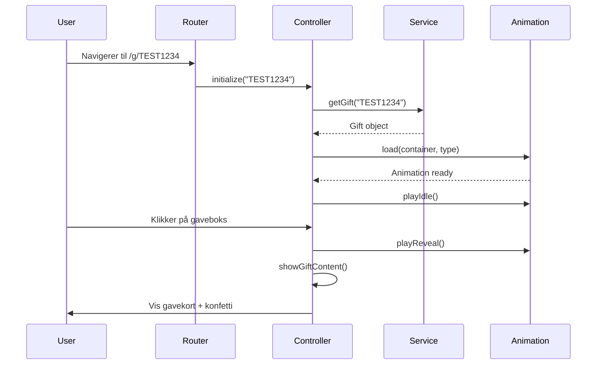

# Gift Reveal PoC - Implementasjonsdokumentasjon

**Prosjekt:** Digital Gavekort Opplevelse - Frontend Prototype
**Versjon:** 1.0 (Anime.js Implementation)
**Dato:** November 2024
**Teknologi:** Vite + TypeScript + Anime.js
**Status:** ✅ Ferdig og deployert

---

## 📋 Innholdsfortegnelse

1. [Prosjektoversikt](#prosjektoversikt)
2. [Tekniske Valg](#tekniske-valg)
3. [Arkitektur](#arkitektur)
4. [Installasjon & Setup](#installasjon--setup)
5. [Kode-walkthrough](#kode-walkthrough)
6. [Testing](#testing)
7. [Deployment](#deployment)
8. [Integrasjon i Større Prosjekter](#integrasjon-i-større-prosjekter)
9. [Best Practices](#best-practices)
10. [Fremtidige Forbedringer](#fremtidige-forbedringer)

---

## 1. Prosjektoversikt

### 1.1 Formål
En proof-of-concept for en interaktiv gavekort-opplevelse der mottakere får en animert "unwrapping"-opplevelse før gavekortet overføres til Mine Gavekort-appen.

### 1.2 Kjerneopplevelse
```
1. Bruker klikker deeplink (SMS/e-post) → /g/TEST1234
2. Ser animert gaveboks med sløyfe
3. Ett trykk → Sløyfe flyr av → Lokk flyr av → Sparkles + konfetti
4. Gavekort-detaljer fades inn
5. "Hent gavekortet" sender til Mine Gavekort-appen
```

### 1.3 Demo URL
- **GitHub Pages:** https://[username].github.io/gift-reveal-poc/
- **Lokal:** http://localhost:3000/

### 1.4 Test-scenarier
| URL | Scenario |
|-----|----------|
| `/g/TEST1234` | Bursdagsgave - Happy path |
| `/g/TESTBRYL` | Bryllupsgave - Wedding theme |
| `/g/TESTUSED` | Allerede aktivert |
| `/g/TESTERR1` | Gavekort finnes ikke |
| `/g/TESTEXP1` | Gavekort utløpt |

---

## 2. Tekniske Valg

### 2.1 Animasjonsbibliotek: Anime.js

**Valgt:** Anime.js (8 KB) i stedet for Lottie Web
**Begrunnelse:**
- ✅ **Lettere bundle** (8 KB vs 100+ KB)
- ✅ **Full kontroll** over animasjonslogikk i kode
- ✅ **Ingen eksterne assets** (JSON-filer) å vedlikeholde
- ✅ **Enklere timing-synkronisering** med confetti og UI
- ✅ **Bedre for PoC** der vi eksperimenterer med animasjoner
- ⚠️ **Tradeoff:** Må kode animasjoner i JS vs bruke designer-laget Lottie

**Når bruke Lottie i stedet:**
- Komplekse, designer-drevne animasjoner
- Mange ulike animasjonsvarianter
- Behov for frame-by-frame kontroll fra design

### 2.2 State Management

**Valgt:** Vanilla JS med klasser
**Begrunnelse:**
- PoC trenger ikke Redux/Zustand
- Controller pattern holder state lokalt
- Enkel å migrere til Angular/React senere

### 2.3 Styling

**Valgt:** SCSS med BEM-inspirert navngivning
**Begrunnelse:**
- SCSS variabler for temaer
- Nestede selectors for lesbarhet
- Lett å portere til Angular/React

### 2.4 Build Tool

**Valgt:** Vite
**Begrunnelse:**
- Lynrask hot reload
- Built-in TypeScript support
- Moderne ES modules
- Perfekt for PoC-utvikling

---

## 3. Arkitektur

### 3.1 Lagdelt Arkitektur

```
┌─────────────────────────────────────┐
│         Presentation Layer          │
│  (main.ts, GiftRevealController)    │
└──────────────┬──────────────────────┘
               │
┌──────────────▼──────────────────────┐
│         Business Logic Layer        │
│  (gift.service.ts, Router)          │
└──────────────┬──────────────────────┘
               │
┌──────────────▼──────────────────────┐
│           Data Layer                │
│  (mock.service.ts, models)          │
└─────────────────────────────────────┘
```

### 3.2 Design Patterns

#### 3.2.1 Service Pattern
```typescript
// Abstraksjon for datahenting
interface IGiftService {
  getGift(code: string): Promise<Gift>
  markAsOpened(code: string): Promise<void>
  getTransferLink(code: string): TransferResponse
}

// Factory for enkel mock/real switching
export function createGiftService(useMocks: boolean): IGiftService {
  return useMocks ? new MockGiftService() : new ApiGiftService()
}
```

**Fordeler:**
- ✅ Enkelt å bytte fra mock til real API
- ✅ Testbar
- ✅ Type-safe

#### 3.2.2 Controller Pattern
```typescript
export class GiftRevealController {
  private state: RevealState

  constructor(
    private container: HTMLElement,
    private giftService: IGiftService
  ) {}

  async initialize(code: string): Promise<void>
  private async renderGiftBox(gift: Gift): Promise<void>
  private setupInteractions(gift: Gift): void
  private handleTap(): Promise<void>
}
```

**Fordeler:**
- ✅ Separasjon av bekymringer (SoC)
- ✅ Lett å teste business logic
- ✅ Enkel migrasjon til Angular components

#### 3.2.3 Strategy Pattern (Animations)
```typescript
// Kan lett bytte animasjonsmotor
class AnimeGiftAnimation implements IGiftAnimation {
  playReveal(): Promise<void>
}

class LottieGiftAnimation implements IGiftAnimation {
  playReveal(): Promise<void>
}
```

### 3.3 Dataflyt



---

## 4. Installasjon & Setup

### 4.1 Prerequisites
- Node.js 18+ og npm 9+
- Git
- Moderne nettleser (Chrome 90+, Safari 14+)

### 4.2 Steg-for-steg

```bash
# 1. Klon repository
git clone [repo-url]
cd gift-reveal-poc

# 2. Installer dependencies
npm install

# 3. Start dev server
npm run dev
# → Åpner på http://localhost:3000

# 4. Test på mobil
# Finn IP-adresse
ipconfig getifaddr en0  # macOS
# Åpne http://[DIN-IP]:3000 på mobil
```

### 4.3 Dependencies

```json
{
  "dependencies": {
    "animejs": "^3.2.2",           // Animasjonsmotor
    "canvas-confetti": "^1.9.3",   // Konfetti-effekt
    "lottie-web": "^5.12.2"        // (Installert, ikke brukt)
  },
  "devDependencies": {
    "@types/animejs": "^3.1.13",
    "@types/canvas-confetti": "^1.6.4",
    "@types/node": "^20.10.0",
    "sass": "^1.69.5",
    "typescript": "^5.3.0",
    "vite": "^5.0.0"
  }
}
```

---

## 5. Kode-walkthrough

### 5.1 Entry Point (main.ts)

```typescript
class App {
  private router: Router
  private container: HTMLElement

  constructor() {
    this.container = document.getElementById('app')!
    this.router = new Router()
    this.initializeRoutes()
  }

  private initializeRoutes(): void {
    // Hovedrute: /g/{8-tegn kode}
    this.router.register(
      /^\/g\/([a-zA-Z0-9]{8})$/,
      async (match) => {
        const code = match[1]
        const controller = new GiftRevealController(
          this.container,
          createGiftService(config.USE_MOCKS)
        )
        await controller.initialize(code)
      }
    )

    // Homepage med test-lenker
    this.router.register(/^\/$/, () => this.showHomepage())

    // Catch-all for ugyldige paths
    this.router.register(/^.*$/, () => this.showError('Ugyldig gave-link'))
  }

  public start(): void {
    const path = window.location.pathname
    this.router.navigate(path)

    // SPA navigation
    window.addEventListener('popstate', () => {
      this.router.navigate(window.location.pathname)
    })

    // Intercept link clicks
    document.addEventListener('click', (e) => {
      const link = (e.target as HTMLElement).closest('a')
      if (link && link.hostname === window.location.hostname) {
        e.preventDefault()
        window.history.pushState({}, '', link.pathname)
        this.router.navigate(link.pathname)
      }
    })
  }
}
```

**Nøkkelpoeng:**
- Regex-basert routing for deeplinks
- SPA-navigasjon med history API
- Dependency injection av service

### 5.2 Router (router.ts)

```typescript
export class Router {
  private routes: Route[] = []
  private basePath: string

  constructor() {
    // Støtte for GitHub Pages base path
    this.basePath = import.meta.env.BASE_URL || '/'
  }

  register(pattern: RegExp, handler: RouteHandler): void {
    this.routes.push({ pattern, handler })
  }

  async navigate(path: string): Promise<void> {
    // Fjern base path
    let cleanPath = path
    if (this.basePath !== '/' && path.startsWith(this.basePath)) {
      cleanPath = path.slice(this.basePath.length)
    }

    // Match routes
    for (const route of this.routes) {
      const match = cleanPath.match(route.pattern)
      if (match) {
        await route.handler(match)
        return
      }
    }
  }
}
```

**Nøkkelpoeng:**
- Støtte for subpath deployment (GitHub Pages)
- Asynkron route handling
- Regex capture groups for URL params

### 5.3 Gift Model (gift.model.ts)

```typescript
export interface Gift {
  id: string
  code: string
  vendorName: string
  vendorLogoUrl: string
  amount: number
  currency: 'NOK'
  personalMessage?: string
  senderName: string
  animationType: 'birthday' | 'wedding' | 'generic'
  expiryDate?: Date
  isOpened: boolean
  isActivated: boolean
}

export interface RevealState {
  step: 'loading' | 'ready' | 'shaking' | 'unwrapping' | 'revealed' | 'transferred'
  tapsRemaining: number
  animationProgress: number
  error?: string
}

export interface TransferResponse {
  success: boolean
  appDeepLink: string
  fallbackUrl: string
}
```

**Nøkkelpoeng:**
- Streng typing for alle data
- Enum-lignende types for states
- Klart skille mellom `isOpened` (web) og `isActivated` (app)

### 5.4 Mock Service (mock.service.ts)

```typescript
export class MockGiftService implements IGiftService {
  private delay(ms: number): Promise<void> {
    return new Promise(resolve => setTimeout(resolve, ms))
  }

  async getGift(code: string): Promise<Gift> {
    await this.delay(800) // Simuler nettverkslatency

    const scenario = mockScenarios[code] || mockScenarios['default']

    if (scenario.error) {
      throw new Error(scenario.error)
    }

    return {
      ...scenario,
      code,
      expiryDate: scenario.expiryDate
        ? new Date(scenario.expiryDate)
        : undefined
    }
  }

  async markAsOpened(code: string): Promise<void> {
    await this.delay(300)
    console.log(`[Mock] Gift ${code} marked as opened`)
  }

  getTransferLink(code: string): TransferResponse {
    return {
      success: true,
      appDeepLink: `#transferred-${code}`,
      fallbackUrl: 'https://apps.apple.com/no/app/mine-gavekort/id123456'
    }
  }
}
```

**Nøkkelpoeng:**
- Simulerer realistisk latency
- JSON-baserte test scenarios
- Logging for debugging

### 5.5 GiftRevealController (Hovedlogikk)

```typescript
export class GiftRevealController {
  private state: RevealState = {
    step: 'loading',
    tapsRemaining: 1, // Ett trykk i denne implementasjonen
    animationProgress: 0
  }
  private animation: AnimeGiftAnimation | null = null

  async initialize(code: string): Promise<void> {
    try {
      // 1. Last inn gavekort-data
      const gift = await this.giftService.getGift(code)

      // 2. Sjekk om allerede aktivert
      if (gift.isActivated) {
        this.showAlreadyActivated(gift)
        return
      }

      // 3. Render gaveboks
      await this.renderGiftBox(gift)

      // 4. Marker som åpnet (web-side åpnet)
      if (!gift.isOpened) {
        await this.giftService.markAsOpened(code)
      }

      // 5. Setup interaksjoner
      this.setupInteractions(gift)

    } catch (error: any) {
      this.showError(error.message)
    }
  }

  private async renderGiftBox(gift: Gift): Promise<void> {
    // Render HTML
    this.container.innerHTML = `
      <div class="gift-reveal-container">
        <div class="gift-header">
          <p class="sender-text">Fra ${gift.senderName}</p>
        </div>

        <div class="gift-box-wrapper">
          <div id="animation-container"></div>
          <div class="tap-indicator visible">
            <span class="tap-count">1</span>
            <span class="tap-text">trykk for å åpne</span>
          </div>
        </div>

        <div class="gift-content hidden" id="gift-content">
          <!-- Gavekort-detaljer -->
        </div>
      </div>
    `

    // Last inn animasjon
    this.animation = new AnimeGiftAnimation()
    await this.animation.load(
      document.getElementById('animation-container')!,
      gift.animationType
    )

    // Start idle animasjon (subtil bounce)
    this.animation.playIdle()

    this.state.step = 'ready'
  }

  private async handleTap(): Promise<void> {
    this.state.tapsRemaining--

    if (this.state.tapsRemaining === 0) {
      this.state.step = 'revealed'
      this.triggerSynchronizedReveal()
    }
  }

  private async triggerSynchronizedReveal(): Promise<void> {
    // 1. Skjul tap indicator
    document.querySelector('.tap-indicator')?.classList.remove('visible')

    // 2. Start reveal-animasjon
    const revealPromise = this.animation!.playReveal()

    // 3. Konfetti ved riktig tidspunkt (900ms)
    setTimeout(() => {
      const confetti = new ConfettiEffect()
      confetti.burst()
    }, 900)

    // 4. Vis gavekort-content (1300ms)
    setTimeout(() => {
      this.showGiftContent()
    }, 1300)

    await revealPromise
  }

  private showGiftContent(): void {
    // Fade ut gaveboks
    const giftBoxWrapper = document.querySelector('.gift-box-wrapper') as HTMLElement
    if (giftBoxWrapper) {
      giftBoxWrapper.style.transition = 'opacity 0.4s ease'
      giftBoxWrapper.style.opacity = '0'
      setTimeout(() => {
        giftBoxWrapper.style.display = 'none'
      }, 400)
    }

    // Fade inn gavekort
    const content = document.getElementById('gift-content')
    if (content) {
      content.classList.remove('hidden')
      content.style.opacity = '0'
      content.style.transition = 'opacity 0.6s ease'
      requestAnimationFrame(() => {
        requestAnimationFrame(() => {
          content.style.opacity = '1'
        })
      })
    }
  }
}
```

**Nøkkelpoeng:**
- Tydelig sekvensering av asynkrone operasjoner
- Synkronisert timing mellom animasjon, konfetti og UI
- Robust error handling
- State management med enum-lignende steps

### 5.6 Anime.js Animation (AnimeGiftAnimation.ts)

```typescript
export class AnimeGiftAnimation {
  private container: HTMLElement | null = null
  private box!: HTMLElement
  private lid!: HTMLElement
  private ribbonV!: HTMLElement
  private ribbonH!: HTMLElement
  private bow!: HTMLElement
  private sparkles: HTMLElement[] = []
  private idleAnimation: any = null

  async load(container: HTMLElement, type: 'birthday' | 'wedding' | 'generic'): Promise<void> {
    this.container = container

    // Tema-farger
    const themes = {
      birthday: {
        box: '#FFB6C1',      // Rosa
        lid: '#FF69B4',
        ribbon: '#FF1493',   // Pink
        sparkle: '#FFD700'   // Gull
      },
      wedding: {
        box: '#FFF0F5',      // Hvit
        lid: '#FFE4E1',
        ribbon: '#C0C0C0',   // Sølv
        sparkle: '#FFFFFF'
      },
      generic: {
        box: '#F0F0F0',
        lid: '#E0E0E0',
        ribbon: '#888888',
        sparkle: '#CCCCCC'
      }
    }

    const colors = themes[type]

    // Generer HTML med CSS-baserte elementer
    this.container.innerHTML = `
      <div class="anime-gift-container">
        <div class="anime-gift-box">
          <div class="anime-gift-body" style="background: ${colors.box}"></div>
          <div class="anime-gift-lid" style="background: ${colors.lid}"></div>
          <div class="anime-ribbon-vertical" style="background: ${colors.ribbon}"></div>
          <div class="anime-ribbon-horizontal" style="background: ${colors.ribbon}"></div>
          <div class="anime-bow" style="background: ${colors.ribbon}"></div>
          ${[...Array(6)].map((_, i) => `
            <div class="sparkle sparkle-${i}" style="background: ${colors.sparkle}"></div>
          `).join('')}
        </div>
      </div>
    `

    // Hent elementer
    this.box = this.container.querySelector('.anime-gift-box')!
    this.lid = this.container.querySelector('.anime-gift-lid')!
    this.ribbonV = this.container.querySelector('.anime-ribbon-vertical')!
    this.ribbonH = this.container.querySelector('.anime-ribbon-horizontal')!
    this.bow = this.container.querySelector('.anime-bow')!
    this.sparkles = Array.from(this.container.querySelectorAll('.sparkle'))

    return Promise.resolve()
  }

  playIdle(): void {
    // Subtil bounce for å invitere til interaksjon
    this.idleAnimation = anime({
      targets: this.box,
      translateY: [0, -8, 0],
      rotate: [0, -1, 1, 0],
      scale: [1, 1.02, 1],
      duration: 2000,
      easing: 'easeInOutSine',
      loop: true
    })
  }

  async playReveal(): Promise<void> {
    this.stopIdle()

    // SEKVENS: Sløyfe → Bånd → Lokk + Box fade → Sparkles

    // 1. Sløyfe flyr ut (0-800ms)
    anime({
      targets: this.bow,
      translateY: [0, -20, -60, -120, -250, -400],
      translateX: [0, 5, 15, 30, 50, 70],
      rotate: [0, -25, 20, -15, 45, 90],
      scale: [1, 1.05, 1, 0.8, 0.6, 0.3],
      opacity: [1, 1, 0.9, 0.7, 0.4, 0],
      duration: 800,
      easing: 'easeInCubic'
    })

    // 2. Bånd flyr vekk (0-700ms)
    anime({
      targets: this.ribbonV,
      translateY: [0, -50, -120, -220, -350],
      rotate: [0, 10, 25, 45, 70],
      opacity: [1, 0.9, 0.7, 0.4, 0],
      scaleX: [1, 0.9, 0.7, 0.5, 0.3],
      duration: 700,
      easing: 'easeInCubic'
    })

    anime({
      targets: this.ribbonH,
      translateX: [0, 30, 80, 150, 250],
      translateY: [0, -20, -40, -60, -80],
      rotate: [0, -15, -30, -50, -75],
      opacity: [1, 0.9, 0.7, 0.4, 0],
      scaleY: [1, 0.9, 0.7, 0.5, 0.3],
      duration: 700,
      easing: 'easeInCubic'
    })

    await new Promise(resolve => setTimeout(resolve, 700))

    // 3. Lokk flyr av (700-1300ms)
    anime({
      targets: this.lid,
      translateY: -350,
      rotateX: -160,
      rotateZ: 25,
      opacity: 0,
      duration: 600,
      easing: 'easeInCubic'
    })

    anime({
      targets: this.box.querySelector('.anime-gift-body'),
      opacity: 0,
      duration: 600,
      easing: 'easeOutQuad'
    })

    // 4. Sparkles eksploderer (900ms)
    await new Promise(resolve => setTimeout(resolve, 200))

    this.sparkles.forEach((sparkle, i) => {
      const angle = (i / this.sparkles.length) * Math.PI * 2
      anime({
        targets: sparkle,
        translateX: Math.cos(angle) * 200,
        translateY: Math.sin(angle) * 200 - 80,
        scale: [0, 2.5, 0],
        opacity: [0, 1, 0],
        duration: 1000,
        delay: i * 50,
        easing: 'easeOutQuad'
      })
    })

    await new Promise(resolve => setTimeout(resolve, 400))
    return Promise.resolve()
  }
}
```

**Nøkkelpoeng:**
- CSS transforms (ikke canvas/SVG)
- Tydelige timing-sekvenser
- Tema-baserte farger
- Modulær struktur (lett å bytte til Lottie)

### 5.7 Konfetti-effekt (Confetti.ts)

```typescript
export class ConfettiEffect {
  burst(): void {
    // Respekter reduced motion
    if (window.matchMedia('(prefers-reduced-motion: reduce)').matches) {
      return
    }

    const count = 200
    const defaults = {
      origin: { y: 0.5 },
      zIndex: 1000
    }

    function fire(particleRatio: number, opts: any) {
      confetti({
        ...defaults,
        ...opts,
        particleCount: Math.floor(count * particleRatio)
      })
    }

    // Flere bursts for bedre effekt
    fire(0.25, { spread: 26, startVelocity: 55 })
    fire(0.2, { spread: 60 })
    fire(0.35, { spread: 100, decay: 0.91, scalar: 0.8 })
    fire(0.1, { spread: 120, startVelocity: 25, decay: 0.92, scalar: 1.2 })
    fire(0.1, { spread: 120, startVelocity: 45 })
  }
}
```

**Nøkkelpoeng:**
- Accessibility-vennlig (respekterer prefers-reduced-motion)
- Flere burst-waves for rikere effekt
- Konfigurerbare parametere

---

## 6. Testing

### 6.1 Manuell Testing

#### Test-matrix:
| Scenario | URL | Forventet resultat |
|----------|-----|-------------------|
| Happy path (bursdag) | `/g/TEST1234` | ✅ Rosa gaveboks → animasjon → 500 kr H&M |
| Happy path (bryllup) | `/g/TESTBRYL` | ✅ Hvit gaveboks → animasjon → 2500 kr Kitchn |
| Allerede aktivert | `/g/TESTUSED` | ✅ Viser "allerede hentet" melding |
| Ugyldig kode | `/g/TESTERR1` | ✅ Viser feilmelding |
| Utløpt | `/g/TESTEXP1` | ✅ Viser feilmelding |

#### Enhetstest-checklist:
```bash
# Desktop (Chrome)
□ Animasjon laster og spiller smooth
□ Ett trykk trigger hele sekvensen
□ Konfetti vises på riktig tidspunkt
□ Gavekort fades inn pent
□ "Hent gavekortet" viser alert (PoC)

# Mobile (iOS Safari)
□ Tap fungerer (ikke bare hover)
□ Animasjon 60fps
□ Ingen layout shift
□ Font-størrelser lesbare

# Edge cases
□ Rask double-tap kræsjer ikke
□ Tilbake-knapp fungerer
□ Refresh bevarer URL
□ Deeplink fra SMS fungerer
```

### 6.2 Performance Testing

```bash
# Lighthouse audit
npm run build
npx serve dist
# Kjør Lighthouse i Chrome DevTools

# Target metrics:
- First Contentful Paint: < 1.5s
- Largest Contentful Paint: < 2.5s
- Total Blocking Time: < 300ms
- Cumulative Layout Shift: < 0.1
```

### 6.3 Cross-browser Testing

| Browser | Version | Status |
|---------|---------|--------|
| Chrome | 90+ | ✅ Fungerer |
| Safari iOS | 14+ | ✅ Fungerer |
| Safari macOS | 14+ | ✅ Fungerer |
| Edge | 90+ | ✅ Fungerer |
| Firefox | 88+ | ✅ Fungerer |

---

## 7. Deployment

### 7.1 GitHub Pages (Automatisk)

**Setup:**
```bash
# vite.config.ts har allerede:
base: process.env.NODE_ENV === 'production'
  ? '/gift-reveal-poc/'
  : '/'

# Deploy med GitHub Actions (allerede satt opp)
git push origin main
# → Automatisk deploy til GitHub Pages
```

**URL:** `https://[username].github.io/gift-reveal-poc/`

### 7.2 Vercel (Alternativ)

```bash
# 1. Installer Vercel CLI
npm i -g vercel

# 2. Deploy
vercel

# 3. Følg instruksjonene
# Output directory: dist
# Build command: npm run build
```

### 7.3 Netlify (Alternativ)

```bash
# 1. Opprett netlify.toml
cat > netlify.toml << EOF
[build]
  command = "npm run build"
  publish = "dist"

[[redirects]]
  from = "/*"
  to = "/index.html"
  status = 200
EOF

# 2. Deploy via UI eller CLI
netlify deploy --prod
```

### 7.4 Environment Variables

For produksjon (når real API kobles på):

```bash
# .env.production
VITE_USE_MOCKS=false
VITE_API_URL=https://api.igive.no
VITE_APP_SCHEME=igive://
VITE_IOS_APP_ID=123456789
VITE_ANDROID_PACKAGE=no.igive.minegavekort
```

---

## 8. Integrasjon i Større Prosjekter

### 8.1 Integrasjon i Angular-appen (Mine Gavekort)

#### Scenario: Eksisterende Ionic/Angular-app skal ha samme opplevelse

#### Steg 1: Opprett Feature Module

```bash
# I Angular-prosjektet
ng generate module pages/gift-reveal --routing
ng generate component pages/gift-reveal
ng generate service pages/gift-reveal/services/gift-reveal
```

#### Steg 2: Kopier gjenbrukbar kode

**Direkte portable filer:**
```
✅ src/core/models/gift.model.ts       → app/models/gift.model.ts
✅ src/ui/animations/AnimeGiftAnimation.ts → app/animations/gift-animation.ts
✅ src/ui/components/Confetti.ts       → app/components/confetti.service.ts
✅ src/ui/styles/main.scss             → app/pages/gift-reveal/gift-reveal.scss
```

#### Steg 3: Tilpass til Angular

**Service:**
```typescript
// PoC: mock.service.ts
export class MockGiftService implements IGiftService {
  async getGift(code: string): Promise<Gift> { ... }
}

// Angular: gift-reveal.service.ts
@Injectable({ providedIn: 'root' })
export class GiftRevealService implements IGiftService {
  constructor(private http: HttpClient) {}

  async getGift(code: string): Promise<Gift> {
    return firstValueFrom(
      this.http.get<Gift>(`/api/gifts/${code}`)
    )
  }

  async markAsOpened(code: string): Promise<void> {
    return firstValueFrom(
      this.http.post<void>(`/api/gifts/${code}/open`, {})
    )
  }

  getTransferLink(code: string): TransferResponse {
    return {
      success: true,
      appDeepLink: `igive://add-gift?code=${code}&token=${this.generateToken(code)}`,
      fallbackUrl: 'https://apps.apple.com/no/app/mine-gavekort/id123456'
    }
  }
}
```

**Component:**
```typescript
// gift-reveal.component.ts
@Component({
  selector: 'app-gift-reveal',
  templateUrl: './gift-reveal.component.html',
  styleUrls: ['./gift-reveal.component.scss']
})
export class GiftRevealComponent implements OnInit, OnDestroy {
  gift?: Gift
  state: RevealState = {
    step: 'loading',
    tapsRemaining: 1,
    animationProgress: 0
  }
  private animation?: AnimeGiftAnimation

  constructor(
    private route: ActivatedRoute,
    private giftService: GiftRevealService,
    private deepLinks: Deeplinks  // Ionic plugin
  ) {}

  async ngOnInit() {
    const code = this.route.snapshot.paramMap.get('code')!
    await this.initialize(code)
  }

  async initialize(code: string): Promise<void> {
    try {
      this.gift = await this.giftService.getGift(code)

      if (this.gift.isActivated) {
        this.state.step = 'activated'
        return
      }

      await this.giftService.markAsOpened(code)
      this.state.step = 'ready'

      // Load animation når view er klar
      setTimeout(() => this.loadAnimation(), 100)

    } catch (error: any) {
      this.state.step = 'error'
      this.state.error = error.message
    }
  }

  private async loadAnimation() {
    const container = document.getElementById('animation-container')!
    this.animation = new AnimeGiftAnimation()
    await this.animation.load(container, this.gift!.animationType)
    this.animation.playIdle()
  }

  async handleTap() {
    if (this.state.tapsRemaining > 0) {
      this.state.tapsRemaining--

      if (this.state.tapsRemaining === 0) {
        await this.triggerReveal()
      }
    }
  }

  private async triggerReveal() {
    this.state.step = 'revealing'

    const revealPromise = this.animation!.playReveal()

    setTimeout(() => {
      const confetti = new ConfettiEffect()
      confetti.burst()
    }, 900)

    setTimeout(() => {
      this.state.step = 'revealed'
    }, 1300)

    await revealPromise
  }

  async handleTransfer() {
    const transfer = this.giftService.getTransferLink(this.gift!.code)

    try {
      // Prøv å åpne app med Ionic Deeplinks plugin
      await this.deepLinks.route(transfer.appDeepLink)
      this.state.step = 'transferred'
    } catch (error) {
      // Fallback til app store
      window.location.href = transfer.fallbackUrl
    }
  }

  ngOnDestroy() {
    this.animation?.destroy()
  }
}
```

**Template:**
```html
<!-- gift-reveal.component.html -->
<ion-content>
  <!-- Loading state -->
  <div *ngIf="state.step === 'loading'" class="loader">
    <ion-spinner></ion-spinner>
    <p>Henter gaven din...</p>
  </div>

  <!-- Ready state -->
  <div *ngIf="state.step === 'ready' || state.step === 'revealing'"
       class="gift-reveal-container">
    <div class="gift-header">
      <p class="sender-text">Fra {{ gift?.senderName }}</p>
    </div>

    <div class="gift-box-wrapper" (click)="handleTap()">
      <div id="animation-container"></div>
      <div class="tap-indicator" [class.visible]="state.tapsRemaining > 0">
        <span class="tap-count">{{ state.tapsRemaining }}</span>
        <span class="tap-text">trykk for å åpne</span>
      </div>
    </div>

    <div class="gift-content" [class.hidden]="state.step !== 'revealed'">
      <div class="gift-card">
        <div class="vendor-info">
          
          <h2>{{ gift?.vendorName }}</h2>
        </div>
        <h1 class="gift-amount">{{ gift?.amount }} kr</h1>

        <div *ngIf="gift?.personalMessage" class="message-card">
          <p>{{ gift?.personalMessage }}</p>
          <span class="sender">- {{ gift?.senderName }}</span>
        </div>

        <ion-button expand="block" size="large" (click)="handleTransfer()">
          Hent gavekortet 🎁
        </ion-button>
      </div>
    </div>
  </div>

  <!-- Already activated state -->
  <div *ngIf="state.step === 'activated'" class="status-container">
    <ion-icon name="checkmark-circle" color="success"></ion-icon>
    <h1>Gavekortet er allerede hentet</h1>
    <p>Dette gavekortet er allerede lagt til i Mine Gavekort-appen.</p>
    <ion-button routerLink="/my-gifts">Åpne Mine Gavekort</ion-button>
  </div>

  <!-- Error state -->
  <div *ngIf="state.step === 'error'" class="status-container error">
    <ion-icon name="alert-circle" color="danger"></ion-icon>
    <h1>Noe gikk galt</h1>
    <p>{{ state.error }}</p>
    <ion-button (click)="initialize(gift?.code || '')">Prøv igjen</ion-button>
  </div>
</ion-content>
```

**Routing:**
```typescript
// app-routing.module.ts
{
  path: 'g/:code',
  loadChildren: () => import('./pages/gift-reveal/gift-reveal.module')
    .then(m => m.GiftRevealModule)
}
```

#### Steg 4: Installer dependencies

```bash
npm install animejs canvas-confetti
npm install --save-dev @types/animejs @types/canvas-confetti
```

#### Steg 5: Konfigurer Deeplinks (Ionic)

```bash
# Installer Ionic Deeplinks plugin
ionic cordova plugin add ionic-plugin-deeplinks
npm install @ionic-native/deeplinks
```

```typescript
// app.component.ts
import { Deeplinks } from '@ionic-native/deeplinks/ngx'

constructor(private deeplinks: Deeplinks) {
  this.deeplinks.route({
    '/g/:code': 'GiftRevealComponent'
  }).subscribe(match => {
    console.log('Deeplink match:', match)
  }, nomatch => {
    console.error('No deeplink match:', nomatch)
  })
}
```

**iOS Setup (Info.plist):**
```xml
<key>CFBundleURLTypes</key>
<array>
  <dict>
    <key>CFBundleURLSchemes</key>
    <array>
      <string>igive</string>
    </array>
  </dict>
</array>
```

**Android Setup (AndroidManifest.xml):**
```xml
<intent-filter>
  <data android:scheme="igive" android:host="add-gift" />
  <action android:name="android.intent.action.VIEW" />
  <category android:name="android.intent.category.DEFAULT" />
  <category android:name="android.intent.category.BROWSABLE" />
</intent-filter>
```

### 8.2 Integrasjon i React-app

```typescript
// GiftRevealPage.tsx
import { useParams, useNavigate } from 'react-router-dom'
import { useEffect, useState, useRef } from 'react'
import { AnimeGiftAnimation } from '../animations/AnimeGiftAnimation'
import { ConfettiEffect } from '../components/ConfettiEffect'
import type { Gift, RevealState } from '../models/gift.model'

export function GiftRevealPage() {
  const { code } = useParams<{ code: string }>()
  const navigate = useNavigate()

  const [gift, setGift] = useState<Gift | null>(null)
  const [state, setState] = useState<RevealState>({
    step: 'loading',
    tapsRemaining: 1,
    animationProgress: 0
  })

  const animationRef = useRef<AnimeGiftAnimation | null>(null)
  const containerRef = useRef<HTMLDivElement>(null)

  useEffect(() => {
    if (code) {
      initialize(code)
    }

    return () => {
      animationRef.current?.destroy()
    }
  }, [code])

  async function initialize(code: string) {
    try {
      const response = await fetch(`/api/gifts/${code}`)
      const giftData = await response.json()

      if (giftData.isActivated) {
        setState(s => ({ ...s, step: 'activated' }))
        return
      }

      setGift(giftData)
      setState(s => ({ ...s, step: 'ready' }))

      // Load animation
      if (containerRef.current) {
        animationRef.current = new AnimeGiftAnimation()
        await animationRef.current.load(containerRef.current, giftData.animationType)
        animationRef.current.playIdle()
      }

    } catch (error: any) {
      setState(s => ({ ...s, step: 'error', error: error.message }))
    }
  }

  async function handleTap() {
    if (state.tapsRemaining > 0) {
      setState(s => ({ ...s, tapsRemaining: s.tapsRemaining - 1 }))

      if (state.tapsRemaining === 1) {
        await triggerReveal()
      }
    }
  }

  async function triggerReveal() {
    setState(s => ({ ...s, step: 'revealing' }))

    const revealPromise = animationRef.current?.playReveal()

    setTimeout(() => {
      const confetti = new ConfettiEffect()
      confetti.burst()
    }, 900)

    setTimeout(() => {
      setState(s => ({ ...s, step: 'revealed' }))
    }, 1300)

    await revealPromise
  }

  function handleTransfer() {
    // Open app via deeplink
    window.location.href = `igive://add-gift?code=${code}`

    // Fallback to app store
    setTimeout(() => {
      if (document.visibilityState === 'visible') {
        window.location.href = 'https://apps.apple.com/no/app/mine-gavekort/id123456'
      }
    }, 2000)
  }

  if (state.step === 'loading') {
    return <div className="loader">Henter gaven din...</div>
  }

  if (state.step === 'error') {
    return (
      <div className="error-state">
        <h1>Noe gikk galt</h1>
        <p>{state.error}</p>
      </div>
    )
  }

  return (
    <div className="gift-reveal-container">
      {(state.step === 'ready' || state.step === 'revealing') && (
        <>
          <div className="gift-header">
            <p>Fra {gift?.senderName}</p>
          </div>

          <div className="gift-box-wrapper" onClick={handleTap}>
            <div ref={containerRef} id="animation-container" />
            {state.tapsRemaining > 0 && (
              <div className="tap-indicator visible">
                <span className="tap-count">{state.tapsRemaining}</span>
                <span className="tap-text">trykk for å åpne</span>
              </div>
            )}
          </div>
        </>
      )}

      {state.step === 'revealed' && (
        <div className="gift-content">
          <h2>{gift?.vendorName}</h2>
          <h1>{gift?.amount} kr</h1>
          {gift?.personalMessage && (
            <div className="message-card">
              <p>{gift.personalMessage}</p>
              <span>- {gift.senderName}</span>
            </div>
          )}
          <button onClick={handleTransfer}>
            Hent gavekortet 🎁
          </button>
        </div>
      )}
    </div>
  )
}
```

### 8.3 Backend Integration

**API Endpoints som trengs:**

```typescript
// GET /api/gifts/:code
// Response:
{
  "id": "550e8400-e29b-41d4-a716-446655440000",
  "code": "TEST1234",
  "vendorName": "H&M",
  "vendorLogoUrl": "https://cdn.igive.no/logos/hm.png",
  "amount": 500,
  "currency": "NOK",
  "personalMessage": "Gratulerer med dagen!",
  "senderName": "Kari Nordmann",
  "animationType": "birthday",
  "expiryDate": "2025-12-31T23:59:59Z",
  "isOpened": false,
  "isActivated": false
}

// POST /api/gifts/:code/open
// Marker at web-siden er åpnet (for analytics)
{} // Empty body

// POST /api/gifts/:code/activate
// Aktiverer kortet i appen (returnerer kort-koder)
// MERK: Kalles KUN fra appen, IKKE fra web
{
  "giftCardCode": "XXXX-XXXX-XXXX-XXXX",
  "pin": "1234",
  "activatedAt": "2024-11-15T10:30:00Z"
}
```

**Security:**
```typescript
// Backend må validere:
1. ✅ Gift code eksisterer
2. ✅ Gift ikke er aktivert
3. ✅ Gift ikke er utløpt
4. ✅ Rate limiting (maks 10 forsøk per time)
5. ✅ CORS tillater kun dine domener
6. ✅ HTTPS only
```

---

## 9. Best Practices

### 9.1 Performance

**1. Bundle Optimization**
```typescript
// vite.config.ts
export default defineConfig({
  build: {
    rollupOptions: {
      output: {
        manualChunks: {
          'vendor': ['animejs', 'canvas-confetti']
        }
      }
    }
  }
})
```

**2. Lazy Loading**
```typescript
// Last kun animasjon når nødvendig
async loadAnimation() {
  const { AnimeGiftAnimation } = await import('./animations/AnimeGiftAnimation')
  this.animation = new AnimeGiftAnimation()
}
```

**3. Preload Critical Assets**
```html
<link rel="preload" as="style" href="/assets/main.css">
<link rel="preconnect" href="https://fonts.googleapis.com">
```

### 9.2 Accessibility

**1. Respekter prefers-reduced-motion**
```scss
@media (prefers-reduced-motion: reduce) {
  * {
    animation: none !important;
    transition: none !important;
  }
}
```

**2. Keyboard navigation**
```typescript
container.addEventListener('keydown', (e) => {
  if (e.key === 'Enter' || e.key === ' ') {
    handleTap()
  }
})

container.setAttribute('tabindex', '0')
container.setAttribute('role', 'button')
container.setAttribute('aria-label', 'Trykk for å åpne gavekortet')
```

**3. Screen reader support**
```html
<div aria-live="polite" aria-atomic="true">
  <span class="sr-only">
    {{ state.step === 'revealed' ? 'Gavekortet er nå åpnet' : '' }}
  </span>
</div>
```

### 9.3 Error Handling

**1. Network errors**
```typescript
async getGift(code: string): Promise<Gift> {
  try {
    const response = await fetch(`/api/gifts/${code}`)

    if (!response.ok) {
      if (response.status === 404) {
        throw new Error('Dette gavekortet finnes ikke')
      }
      if (response.status === 410) {
        throw new Error('Dette gavekortet har utløpt')
      }
      throw new Error('Kunne ikke hente gavekortet. Prøv igjen senere.')
    }

    return await response.json()
  } catch (error) {
    if (error instanceof TypeError) {
      throw new Error('Ingen internettforbindelse')
    }
    throw error
  }
}
```

**2. Animation errors**
```typescript
try {
  await this.animation.load(container, type)
  this.animation.playIdle()
} catch (error) {
  console.error('Animation failed:', error)
  // Fallback: Vis static image
  container.innerHTML = ``
}
```

### 9.4 Analytics

```typescript
// Legg til i PoC når backend er klar
class AnalyticsService {
  track(event: string, properties: any) {
    // Google Analytics 4
    gtag('event', event, properties)

    // Mixpanel
    mixpanel.track(event, properties)
  }
}

// Bruk:
analytics.track('gift_opened', {
  gift_code: gift.code,
  vendor: gift.vendorName,
  amount: gift.amount,
  animation_type: gift.animationType
})

analytics.track('gift_revealed', {
  gift_code: gift.code,
  time_to_reveal: Date.now() - startTime
})

analytics.track('gift_transferred', {
  gift_code: gift.code
})
```

---

## 10. Fremtidige Forbedringer

### 10.1 Kort-term (1-2 uker)

**1. Bytt til Lottie**
- Last ned profesjonelle animasjoner fra LottieFiles
- Implementer `GiftBoxAnimation.ts` med Lottie Web
- Få designer til å lage custom animasjoner

**2. Koble til real API**
- Erstatt `MockGiftService` med `ApiGiftService`
- Implementer autentisering (JWT tokens i deeplinks)
- Error handling for edge cases

**3. Analytics**
- Integrer Google Analytics 4
- Track brukerreise fra SMS til app-transfer
- Conversion rate dashboard

### 10.2 Medium-term (1-2 måneder)

**1. A/B Testing**
- Test 1-tap vs 3-tap
- Test ulike animasjoner
- Test meldings-plasseringer

**2. Personalisering**
- Custom fargetema per vendor
- Senderens profilbilde
- Voice message (optional)

**3. PWA**
- Manifest.json for "Add to home screen"
- Service worker for offline support
- Push notifications

### 10.3 Long-term (3-6 måneder)

**1. Advanced Animations**
- 3D CSS transforms
- Particle systems
- WebGL effects (three.js)

**2. Gamification**
- Shake phone to unwrap (DeviceMotion API)
- Scratch-to-reveal
- AR viewing (WebXR)

**3. Social Features**
- Del på sosiale medier
- Video capture av unwrapping
- Takk-melding tilbake til sender

---

## 📚 Appendix

### A. Nyttige Kommandoer

```bash
# Development
npm run dev              # Start dev server
npm run build            # Build for production
npm run preview          # Preview prod build

# Testing
open http://localhost:3000/g/TEST1234
open http://localhost:3000/g/TESTBRYL

# Deployment
git push origin main     # Auto-deploy til GitHub Pages

# Debugging
npm run build -- --mode development  # Build med source maps
```

### B. Fil-oversikt

```
gift-reveal-poc/
├── src/
│   ├── main.ts                          # Entry point (153 linjer)
│   ├── router.ts                        # URL routing (55 linjer)
│   ├── config/
│   │   └── app.config.ts               # Config (11 linjer)
│   ├── core/
│   │   ├── models/
│   │   │   └── gift.model.ts          # TypeScript interfaces (27 linjer)
│   │   └── services/
│   │       ├── gift.service.ts        # Service abstraction (13 linjer)
│   │       └── mock.service.ts        # Mock implementation (39 linjer)
│   ├── controllers/
│   │   └── GiftRevealController.ts    # Main business logic (251 linjer)
│   ├── ui/
│   │   ├── animations/
│   │   │   └── AnimeGiftAnimation.ts  # Anime.js wrapper (185 linjer)
│   │   ├── components/
│   │   │   └── Confetti.ts            # Konfetti effekt (52 linjer)
│   │   └── styles/
│   │       └── main.scss              # All styling (693 linjer)
│   └── mocks/
│       └── scenarios.json             # Test data (56 linjer)
├── public/
│   └── images/vendors/
│       └── placeholder-logo.svg
├── index.html                          # HTML entry (22 linjer)
├── vite.config.ts                      # Build config (15 linjer)
├── tsconfig.json                       # TS config (23 linjer)
└── package.json                        # Dependencies (23 linjer)

Total: ~1,618 linjer kode (ekskl. kommentarer)
```

### C. Ressurser

**Dokumentasjon:**
- [Anime.js Docs](https://animejs.com/documentation/)
- [Canvas Confetti](https://github.com/catdad/canvas-confetti)
- [Vite Guide](https://vitejs.dev/guide/)
- [TypeScript Handbook](https://www.typescriptlang.org/docs/)

**Design:**
- [LottieFiles](https://lottiefiles.com/) - For Lottie-animasjoner
- [Coolors](https://coolors.co/) - Farge-paletter
- [Undraw](https://undraw.co/) - SVG illustrasjoner

**Testing:**
- [BrowserStack](https://www.browserstack.com/) - Cross-browser testing
- [Lighthouse](https://developers.google.com/web/tools/lighthouse) - Performance audit

---

## 🤝 Support & Kontakt

**Tekniske spørsmål:**
- GitHub Issues: [repo-url]/issues
- Email: dev@igive.no

**Design feedback:**
- Figma: [figma-link]

**Produksjon-klart:**
- Når backend API er klar
- Når real deeplinks er konfigurert
- Når analytics er satt opp

---

**Status:** ✅ PoC ferdig - Klar for integrasjon
**Neste steg:** Koble til real API og test i staging miljø
**Estimat integrasjon i Angular:** 2-3 dager for fullstendig implementering
